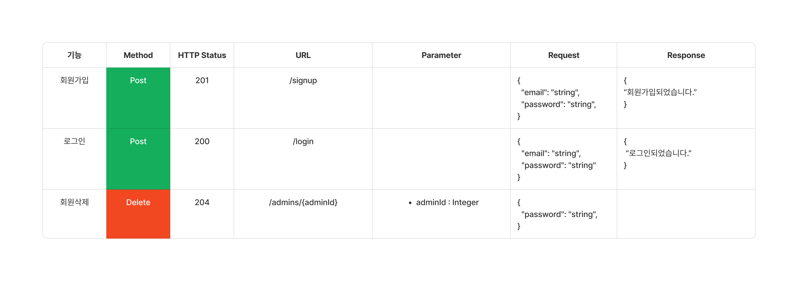

# <strong>공연 검색 Backend Server</strong>

##  프로젝트 개요

- **개발 기간** : 24.02.14 ~ 24.02.23 
- **개발 환경** : Kotlin, Spring Boot, PostgreSql, Redis
- **프로젝트 이름** : LocalConcert
- **프로젝트 설명 :** 공연의 목록을 검색하고, 인기 공연을 확인합니다.

## A04

- <strong>오재영</strong>
    - [github](https://github.com/JYOH3246)
    - 역할 - Reids를 이용한 캐싱
- <strong>박유진</strong>
    - [github](https://github.com/YJ9352)
    - 역할 - 인증 / 인가
- <strong>김철학</strong>
    - [github](https://github.com/lazzzykim)
    - 역할 - ERD, 리뷰 / 리뷰 답글 CRUD
- <strong>변무훈</strong>
    - [github](https://github.com/lovelyunsh)
    - 역할 - API 명세, 주문 Flow Chart, 장바구니 / 주문 CRUD

## **📚기술스택**

  
  
  
  
  
   

### **Backend**

- Spring Boot: 3.2.2
- Kotlin: 1.9.22

- Data
    - Spring JPA: 3.2.3
    - QueryDsl: 5.0.0

- Security
    - Spring Security: 6.2.0
    - JWT: io.jsonwebtoken:jjwt-api:0.12.3
    - Oauth 2.0

### **DB**

- PostgreSql

### **collaboration**

- Git, GitHub Issue, Slack, Github Project

## 주요기능

### 관리자 회원 가입 / 회원 관리
- 관리자 페이지에서 계정을 생성 / 삭제
- Spring Security 활용

### 공연 목록 게시판
- 공연 검색 : 로그인 여부에 상관 없이 이용 가능
- 공연 생성, 수정, 삭제 : 관리자만 삭제 가능
- 어떤 키워드가 많이 검색되었는지 확인 가능
- 캐시를 이용하여 검색의 속도 상승

## 프로젝트 산출물

- [프로젝트 S.A]
https://teamsparta.notion.site/A4-6084c4a6a76f4b28a0337970f1126e84
- [와이어프레임]
 
 
- [API 명세서]
 
 
 
- [ERD]
 
